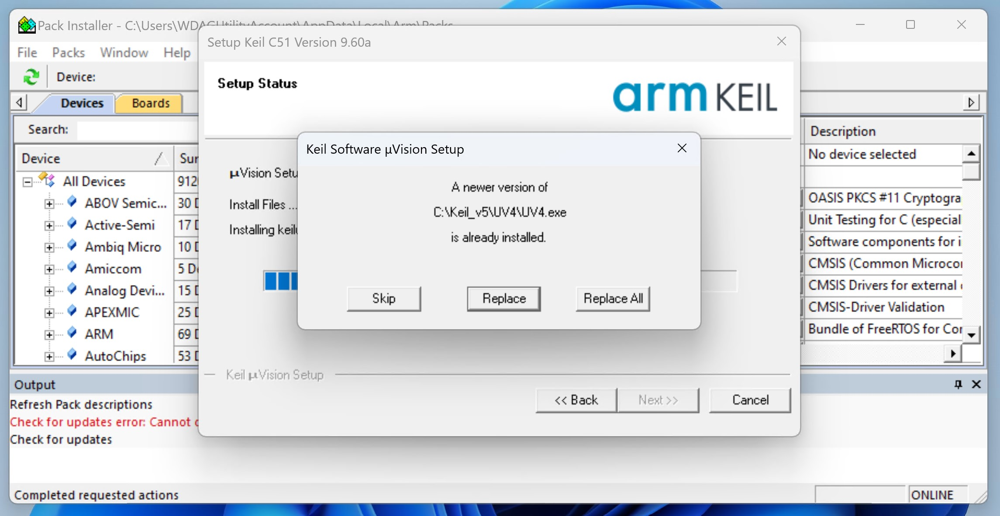

Keil is a German software subsidiary of Arm Holdings. It was founded in 1982 by Günter and Reinhard Keil, initially as a German GbR. ... In October 2005, Keil (Keil Elektronik GmbH in Munich, Germany, and Keil Software, Inc. in Plano, Texas) were acquired by Arm. ([wiki](https://en.wikipedia.org/wiki/Keil_(company)))

软件包全名是 Keil MDK (microcontroller development kit) 。MDK includes the **µVision IDE** and debugger, **Arm C/C++ compiler**, and essential middleware components.

:::{note} 本文不会具体讲解编译器区别、编译参数、库函数、中间件，这些内容请查看[编译工具链](/名词解释/编译工具链)。 <!--[freeRTOS]()。-->
:::

另有 [Keil Studio Cloud](https://studio.keil.arm.com/) ，此处不作介绍，请见官方帮助文档（[可用插件](https://developer.arm.com/documentation/102497/1-5/Extensions)、[可用硬件和仿真](https://developer.arm.com/documentation/102497/1-5/Supported-hardware--custom-targets-and-Virtual-Hardware-Targets)）。

:::{note} 现在 Keil Studio Cloud 通过 [Web USB](https://developer.mozilla.org/zh-CN/docs/Web/API/USB#browser_compatibility) 支持了 STLink 和 CMSIS-DAP。
:::

## 下载

可于<https://www.keil.com/demo/eval/arm.htm>下载[社区版](https://www2.keil.com/mdk5/selector)。虽然要填表，但下载链接形如<https://armkeil.blob.core.windows.net/eval/MDK537.EXE>。

:::{tip} C51 相关文件也可以通过类似 <https://www.keil.com/files/eval/c51v960a.exe> 的链接下载。
:::

安装时可能遇到下列情况：

* 要求输入个人信息、电子邮件等。
  
  随便填写就好。
  
* `A newer version of ... is already installed.`
  
  请选用 `Skip` 。

<!--  -->
<!--  -->


## 初始化配置

### 安装功能包 (pack)

## 从创建工程到烧录程序

:::{hint} You can contribute to this file by reading C.1 in [课程实用链接](/外部资料/课程实用链接). PRs are welcome!
:::

### 工程创建

首先选择 device

### 配置修改

你可能还会用到 `Pack Installer` ，但只有 `Options for Target` `Manage Run-Time Environment` 对当前工程有效。

### 常见窗口讲解

你在菜单栏中 `View` 可以看到可使用的不同窗口。

## 附录

:::{Dropdown} 使用本软件，推荐将 `.gitignore` 配置如下

```sh
$ ls
custom  Drivers  Inc  MDK-ARM  Middlewares  mx_project.ioc  Src

$ cd MDK-ARM && ls
... ... mx_project.uvprojx .gitignore

$ cat .gitignore
```

```sh
# https://github.com/mrshrdlu/gitignore-keil/blob/master/keil.gitignore
# Taken mostly from http://www.keil.com/support/man/docs/uv4/uv4_b_filetypes.htm

# User-specific uVision files
*.opt
*.uvopt
*.uvoptx
*.uvgui
*.uvgui.*
*.uvguix.*

# Generated output files
/Listings/
/Objects/
/RTE/

# Listing files
*.cod
*.htm
*.i
*.lst
*.map
*.m51
*.m66
# define exception below if needed
*.scr

# Object and HEX files
*.axf
*.b[0-3][0-9]
*.hex
*.d
*.crf
*.elf
*.hex
*.h86
*.lib
*.obj
*.o
*.sbr

# Build files
# define exception below if needed
*.bat
*._ia
*.__i
*._ii

# Debugger files
# define exception below if needed
*.ini
/DebugConfig/
```

:::