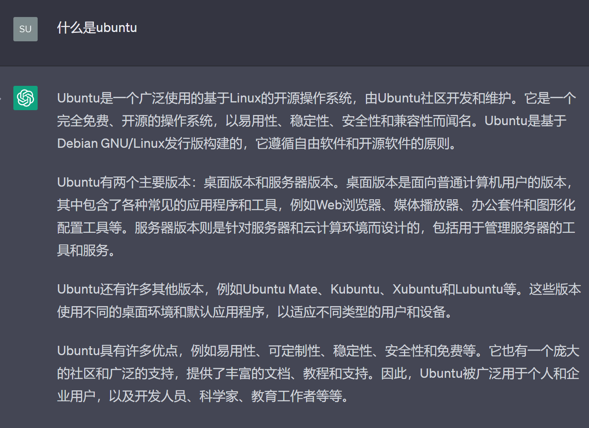

## 简介

用 ChatGPT 的话来讲：



而对于 RoboMaster 这个比赛而言， Ubuntu 操作系统将是视觉算法组以后开发过程中最底层的开发环境，课题一的目的是引导大家学习使用 Ubuntu 操作系统。

:::{admonition} 不使用其他 GNU/Linux 发行版的原因有两点。

1. 实验室小电脑都安装的是 Ubuntu 。
2. ROS2 官方只支持 Ubuntu 的安装包维护。

如果你熟练使用 Docker ，用其他发行版/操作系统也是没问题的。（Take at your own risk.）
:::

## 推荐学习路径

emm因为最近我时间比较紧迫就暂时不会进行大规模培训，引导的方式主要是给大家提供学习的视频、网站以及博客。

* **Step1**

  首先你需要知道 Ubuntu 有很多发行版本，而其中从 6.06 开始每隔俩年会发布一款 [LTS(Long Term Support) 版本](https://wiki.ubuntu.com/Releases)（一般来说你选最近的 LTS 准没错），推荐大家安装 Ubuntu20.04(focal) 进行学习。

* **Step2**

  安装 Ubuntu 大致分为三种路线： wsl2 ，虚拟机，多系统。
  
  某位学长强力推荐使用 wsl2 我就把他去年的培训链接放到这里，大家可以根据他的指导来安装环境，见参考资料 1 。
  
  其他俩种方案可以自行去搜索如何完成，我这里只放了虚拟机如何安装 Ubuntu20.04 的一个指导链接，见参考资料 2 。

  *补：如果你是MacOS用户以上可能对你不太友好，可以去了解下 utm 和 lima （我都不会用），建议自行搜索学习使用。*

* **Step3**

  在配好 Ubuntu 的环境之后，大家需要对它的命令行一些最基础的使用有一定掌握。
  
  这里我会放俩个推荐视频的链接
  
  * 3 是全英文带中文字幕(recommended)

  * 4 为其他 RM 战队的命令行入门先导课 (不要问我为啥我们没有！！！会伤我心)

  * 5 是一个笔记版本的链接 可以在看视频的同时 配合食用

:::{note} **当你做完了这些 请根据[在线文档](https://docs.qq.com/sheet/DRGtxQ05PbHRKTXVO)的提示记录 让我知道你们的进度！**
:::

## 遇到问题怎么办

多看，[然后巧妙地提问](/名词解释/提问的智慧.md)！

可以参考在线文档里关于问题的记录，也可以看看群聊记录里是否讲过了类似内容。

## 参考资料

1. [小老虎去年的培训文档（只需要配置开发环境 1 的第一小点）](/培训/2022夏/嵌软算法组/环境安装.md)
2. [虚拟机安装 Ubuntu20.04](https://zhuanlan.zhihu.com/p/141033713)
3. [The Missing Semester](https://www.bilibili.com/video/BV1x7411H7wa/)
4. [DynamicX 培训课 | 软件开发通用课程--先导课](https://www.bilibili.com/video/BV1oQ4y1i7zA)
5. [The Missing Semester of Your CS Education 中文版](https://missing-semester-cn.github.io/)

## 预告

在下一个课题中，我们会根据你选择的方向，引导大家学习软件的使用。

:::{Dropdown} 这里先给出简单的教程，供完成课题一的同学了解、尝试。

建议更换软件源再下载任何软件包，可参考[重大源更换指南](https://mirrors.cqu.edu.cn/wiki/mirror-wiki/ubuntu/)、[中科大源更换指南](https://mirrors.ustc.edu.cn/help/ubuntu.html)。

在命令行跑完前两行后，你需要增加 ROS2 软件源，可参考[重大 ROS1/2 源添加指南](https://mirrors.cqu.edu.cn/wiki/mirror-wiki/ros/)、[清华 TUNA ROS2 源添加指南](https://mirrors.tuna.tsinghua.edu.cn/help/ros2/)。

总的来说，你需要使用 [apt](https://manpages.ubuntu.com/manpages/xenial/man8/apt.8.html)([explainshell](https://explainshell.com/explain?cmd=sudo+apt+upgrade)) 安装编辑软件、编译软件、 OpenCV 库文件和 ROS2 软件包。

```sh
# 先更新本地软件包缓存，避免过期缓存提示 404
# 提示输入密码时，你的密码输入并不会回显。（这个在 Step3 里有讲哦）
sudo apt upgrade
# 安装好 Ubuntu 就可以立刻安装了
sudo apt install vim-gtk3 build-essential libopencv-dev

# 下面需要你先增加 ROS2 软件源
sudo apt install ros-foxy-desktop # for Ubuntu 20.04(focal) # <https://www.ros.org/reps/rep-2000.html>
# 如果你的磁盘空间有限，则安装下面这个。
sudo apt install ros-foxy-ros-base # dep of ros-foxy-desktop
```

按照你自己的喜好，可能需要安装 VSCode, Codium, Clion 等编辑器或集成环境。

:::