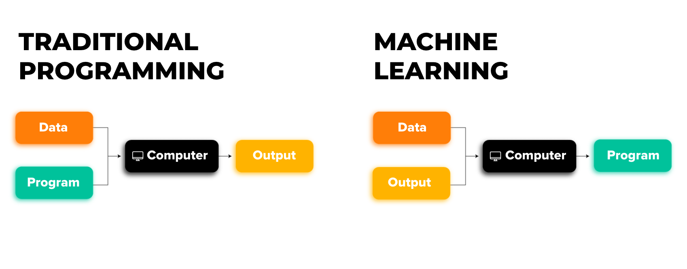
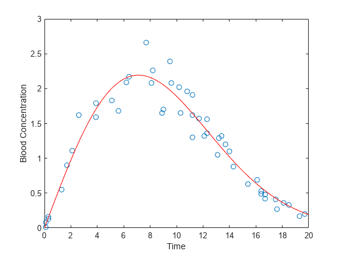
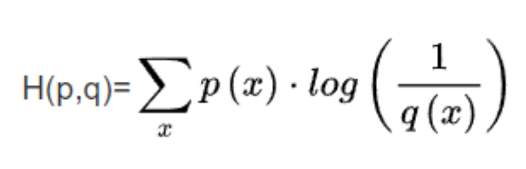
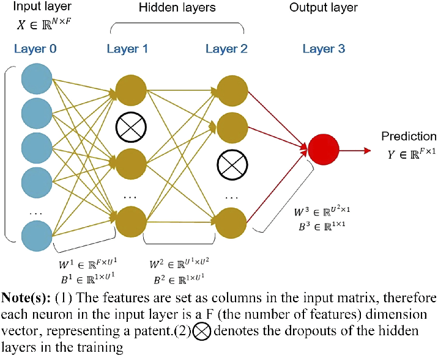
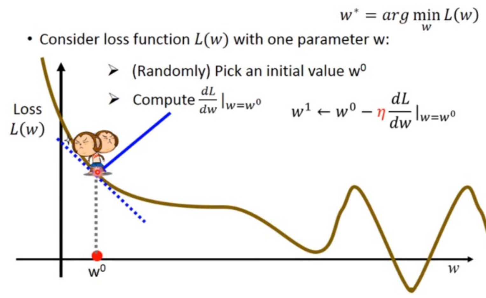

```{contents} Outline
:depth: 1
:local:
:backlinks: entry
:class: this-will-duplicate-information-and-it-is-still-useful-here
```

## Introduction



机器学习是一种人工智能的分支，旨在通过让计算机从数据中学习和改进，从而使其能够执行特定任务而无需明确的编程指令。它是一种使用统计学方法和算法来让计算机自动学习和优化任务的过程。

传统的编程模式需要程序员编写明确的规则和指令，告诉计算机如何执行特定任务。然而，随着数据量的爆炸性增长和复杂任务的出现，编写所有规则变得非常困难甚至不可行。机器学习的目标是克服这一挑战，通过让计算机从数据中学习模式和规律，以便能够做出智能决策或完成任务。

当面对一些具有确定性解决方案但不具备经验求解能力的问题，例如：Classification 传统的编程模式可能就难以找到解决方案，而机器学习在这类情况下将展示它的意义。

在动手尝试之前，你需要对几个基础知识得有一定了解。

- 机器如何进行学习

  - Hand-crafted features (if+else)

  - Numerical Solution (拟合)

    

- 如何评价模型

  - 转化为最小化f(x)来进行实现

  - Loss Function 损失函数

    - L1 Loss: {math}`|\text{ current_result }-\text{ ideal_result }|`

    - L2 Loss: {math}`( \text{ current_result } – \text{ ideal_result } )^2`

    - Cross Entropy Loss 交叉熵

      

- 如何进行优化

  - 线性最小二乘

    只单纯针对一些线性的问题，能够获得唯一确定解，但网络当中是非线性的，而它的优化就需要一些更高级的东西------Feed Forward & Back Propagation 前馈和反向传播
    
## MLP 多层感知机模型



在了解 MLP(Multi-Layer Perceptron) 结构之前，你需要去了解以下几个概念:

- 神经元模型（输入、权重、阈值、神经元状态、激励函数）

- 赫布学习规则

- 感知机（激活函数）

- 基于梯度的优化方式



- 反向传播的相关理论证明（链式法则）

模型框架推荐是使用tensorflow的keras，这是一个高级神经网络API，由纯python编写，（对新手挺友好的！）

## Project 

- 用你想用的模型框架去完成mnist书写数字识别

  注：要求共3层网络(输入+隐藏+输出) 用MLP的网络框架

  - 基础部分：完成数据导入和模型训练(可视化训练过程) 并且能够部署（本地图片进行识别！）

  - 进阶部分：自己制作额外的数据集加入至mnist数据中进行训练(不需要太多)  完成上面基础部分的内容

- 提交形式：

  - 将代码(自制的数据集!)打包发至：[maxandfelixzheng@outlook.com](mailto:maxandfelixzheng@outlook.com)(如果你需要文档补充说明也ok)

  - DDL：2023/8/15 23:59

  有任何问题请私聊管理员Kiwi

## 参考资料

1. MLP相关:<https://zhuanlan.zhihu.com/p/599887970>

2. 【清华大学计算机系科协暑培 2023】神经网络 & PyTorch - AI Track:<https://www.bilibili.com/video/BV1oV4y1t7fg/>

3. 一个可视化的project:<https://github.com/tensorflow/playground>

4. Data labeling:<https://github.com/HumanSignal/label-studio>

5. Pytorch:<https://pytorch.org/tutorials/>

6. 交叉熵损失函数:<https://www.zhihu.com/tardis/zm/art/35709485>

7. Keras

   <http://www.likuli.com/doc/keras/index.html> && <https://keras.io/zh/>

