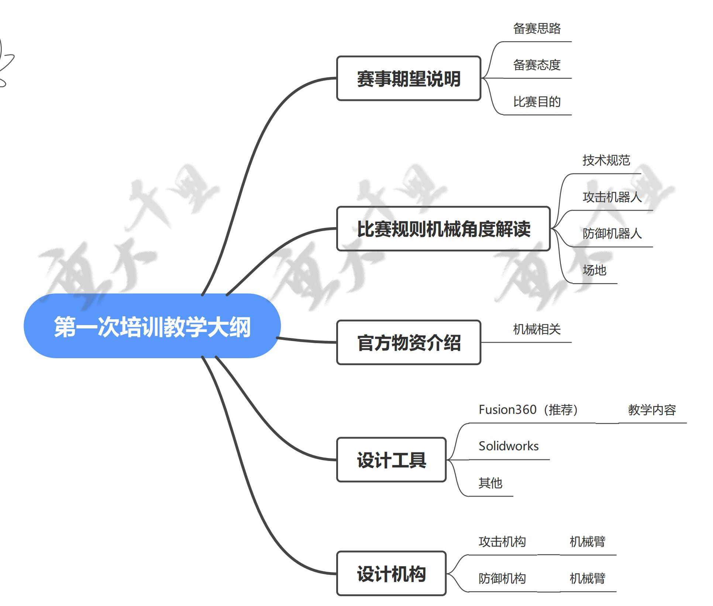
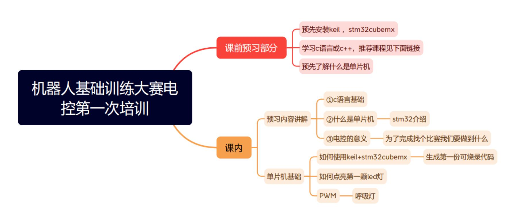

* **地点**：

* **时间**：

* **线上直播**：

届时将显示二课签到二维码。

## 机械组

{width="70%" align=center}

### 课前目标

1. 学会建模软件的基本运用

2. 对规则熟悉且头脑中有demo

3. 有部分创新性想法

### 课前任务

1. Fusion 360 的安装以及学习，相关资源

   官网下载：<https://www.autodesk.com.cn/products/fusion-360/>，记得[申请教育版优惠](https://www.autodesk.com/education/edu-software/)哦！

   官方教学：<https://www.bilibili.com/video/BV11441157cA/>

   千里战队学习资源：[建模入门系列视频](/培训/2022夏/机械组/自主学习资料.md#autodesk-fusion-360-建模入门)或<https://space.bilibili.com/1443755262/search/video?keyword=Fusion>

2. 仔细学习规则手册机器人技术规范部分，找出比赛需求，进行实现方案的预想，课中讲完相关部分会预留时间进行答疑。

3. {bdg-secondary}`选做` 麦克纳姆轮自学资源

   材料文献

   <https://www.guyuehome.com/34367>
   <https://www.guyuehome.com/34376>
   <https://www.guyuehome.com/34385>
   <https://zhuanlan.zhihu.com/p/539011125>

   麦轮详细设计的研究开源

   <https://bbs.robomaster.com/forum.php?mod=viewthread&tid=10840>
   <https://bbs.robomaster.com/forum.php?mod=viewthread&tid=2305>
   <https://bbs.robomaster.com/forum.php?mod=viewthread&tid=11620>
   <https://www.bilibili.com/video/BV1B741157Kx/>

### 课后目标

1. 能熟练运用至少一种建模软件
2. 进行比赛机构的初版设计
3. 有迭代意识并实施

## 电控组

{width="70%" align=center}

### 课前目标

1. 在个人电脑上安装 keil 软件与 stm32cubemx 软件,并在 keil 中安装 f1 芯片包。

2. 完成黑马程序员 1-40 节内容学习,了解 c++ 基本语法

3. 初步去网上搜集资料了解何为单片机

### 课前任务

1. 安装 keil,安装 stm32cubemx 软件,在 keil 中安装 f1 芯片包,该步骤可自行百度

2. {bdg-danger}`重要` 完成至少 1-40 节教学

   <https://www.bilibili.com/video/BV1et411b73Z/>

### 课后目标

1. 能够独自配置 IO 口进行高低电平输出;

2. 能够在 IO 口硬件输出 PWM 波;

3. 能够学会基本操作不同型号的单片机的 IO 口;
